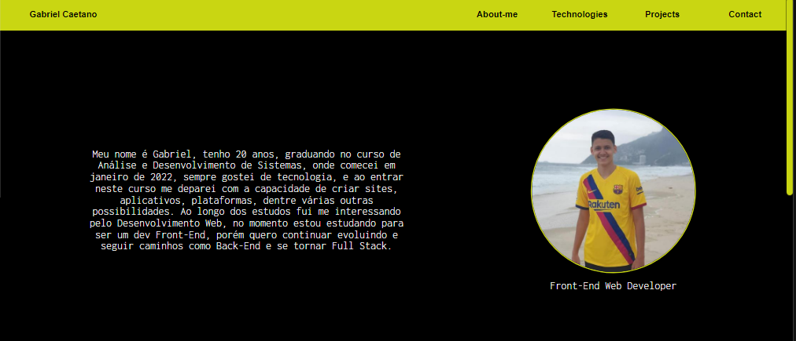

<h1 align="center"> Portfólio - Gabriel Caetano </h1>

Meu potfólio, desenvolvido para mostrar quais tecnologias aprendi/estou aprendendo, e demonstrar minhas habilidades na construção de sites com os conhecimentos que adquiri

  <a href="#-tecnologias">Tecnologias</a>&nbsp;&nbsp;&nbsp;|&nbsp;&nbsp;&nbsp;
  <a href="#-projeto">Projeto</a>&nbsp;&nbsp;&nbsp;

 

  

## 🚀 Tecnologias

Esse projeto foi desenvolvido com as seguintes tecnologias:

- HTML
- CSS
- JavaScript

## 💻 Projeto

Neste projeto procurei aplicar os conhecimentos de HTML, CSS e Javascript, quero continuar ao longo do tempo evoluindo o código, com isso criei ele de uma maneira mais simples, com a ideia de depois refatorar o código, tornar mais responsivo, treinar os conhecimentos, adicionando mais funcionalidades usando javascript por exemplo.
